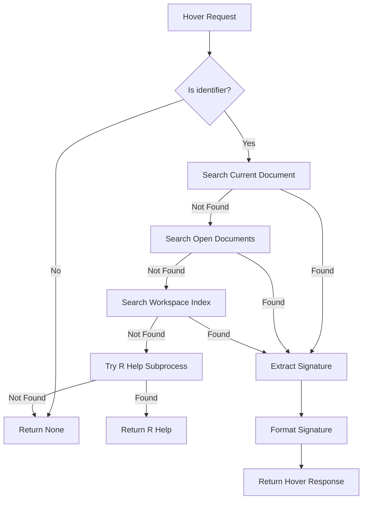

# Design Document: User-Defined Function Hover

## Overview

This design extends the existing hover handler in rlsp to provide hover information for user-defined functions. The current implementation only supports built-in R functions via R subprocess calls. This enhancement adds a lookup mechanism that searches for function definitions in the current document, open documents, and workspace index, then extracts and formats the function signature from the tree-sitter AST.

The design prioritizes user-defined functions over built-in functions, ensuring that if a user shadows a built-in function, the hover shows the user's definition.

## Architecture

The hover feature follows a layered lookup strategy:



### Key Design Decisions

1. **User-defined functions take priority**: Search user code before falling back to R help
2. **Reuse existing tree traversal patterns**: Follow the same AST traversal approach used in `find_definition_in_tree`
3. **Extract signature at hover time**: Don't pre-index signatures; extract from AST when needed
4. **Consistent formatting**: Use `function_name(param1, param2 = default)` format

## Components and Interfaces

### Modified Components

#### `handlers.rs` - `hover` function

The main hover handler will be modified to:

1. First attempt to find a user-defined function definition
2. Extract the function signature if found
3. Fall back to R help if no user-defined function is found

```rust
pub fn hover(state: &WorldState, uri: &Url, position: Position) -> Option<Hover> {
    // ... existing identifier extraction ...
    
    // NEW: Try user-defined function first
    if let Some(signature) = find_user_function_signature(state, uri, &name) {
        return Some(Hover {
            contents: HoverContents::Markup(MarkupContent {
                kind: MarkupKind::Markdown,
                value: format!("```r\n{}\n```", signature),
            }),
            range: Some(node_range),
        });
    }
    
    // EXISTING: Fall back to R help
    // ... existing R help code ...
}
```

### New Functions

#### `find_user_function_signature`

Searches for a function definition and extracts its signature.

```rust
fn find_user_function_signature(
    state: &WorldState,
    current_uri: &Url,
    name: &str,
) -> Option<String> {
    // Search order: current doc -> open docs -> workspace index
    // Returns formatted signature string
}
```

#### `find_function_definition_node`

Finds the function definition AST node for a given name.

```rust
fn find_function_definition_node<'a>(
    node: Node<'a>,
    name: &str,
    text: &str,
) -> Option<Node<'a>> {
    // Traverse AST to find assignment where RHS is function_definition
    // Returns the function_definition node
}
```

#### `extract_function_signature`

Extracts a formatted signature string from a function definition node.

```rust
fn extract_function_signature(
    func_node: Node,
    func_name: &str,
    text: &str,
) -> String {
    // Parse parameters node
    // Format as "func_name(param1, param2 = default, ...)"
}
```

#### `extract_parameters`

Extracts parameter information from a parameters node.

```rust
fn extract_parameters(params_node: Node, text: &str) -> Vec<String> {
    // Iterate over parameter children
    // Extract name and optional default value
    // Return list of formatted parameter strings
}
```

## Data Models

### Parameter Representation

Parameters are represented as formatted strings during extraction:

| Parameter Type | Format |
|---------------|--------|
| Simple parameter | `param_name` |
| Parameter with default | `param_name = default_expr` |
| Dots parameter | `...` |

### Tree-sitter Node Types

The relevant tree-sitter-r node types for function definitions:

| Node Kind | Description |
|-----------|-------------|
| `binary_operator` | Assignment expression (contains `<-`, `=`, `<<-`) |
| `function_definition` | The `function(...)` expression |
| `parameters` | Container for function parameters |
| `parameter` | Individual parameter (may have name and default) |
| `identifier` | Variable/function name |

### AST Structure Example

For `add <- function(a, b = 1) { a + b }`:

```
binary_operator
├── identifier: "add"
├── "<-"
└── function_definition
    ├── "function"
    ├── parameters
    │   ├── parameter
    │   │   └── identifier: "a"
    │   ├── ","
    │   └── parameter
    │       ├── identifier: "b"
    │       ├── "="
    │       └── float: "1"
    └── brace_list (body)
```


## Correctness Properties

*A property is a characteristic or behavior that should hold true across all valid executions of a system—essentially, a formal statement about what the system should do. Properties serve as the bridge between human-readable specifications and machine-verifiable correctness guarantees.*

### Property 1: Signature Format Correctness

*For any* user-defined function with a valid name and parameter list, extracting the signature SHALL produce a string in the format `name(params)` where `name` matches the function name and `params` contains all parameter names separated by commas.

**Validates: Requirements 1.1, 1.2**

### Property 2: Parameter Extraction Completeness

*For any* function definition with parameters (including simple parameters, parameters with defaults, and `...`), the extracted signature SHALL contain all parameters with their default values preserved in the original order.

**Validates: Requirements 1.4, 4.2, 4.3**

### Property 3: Current Document Search Priority

*For any* function name that is defined in both the current document and another source (open document or workspace index), the hover handler SHALL return the signature from the current document's definition.

**Validates: Requirements 2.1, 2.4**

### Property 4: User-Defined Function Priority Over Built-ins

*For any* function name that matches both a user-defined function and a built-in R function, the hover handler SHALL return the user-defined function's signature rather than R help documentation.

**Validates: Requirements 3.2**

### Property 5: Assignment Operator Handling

*For any* of the R assignment operators (`<-`, `=`, `<<-`), when used to define a function, the system SHALL correctly identify and extract the function signature.

**Validates: Requirements 4.4**

## Error Handling

### Scenarios and Responses

| Scenario | Response |
|----------|----------|
| Hover on non-identifier node | Return `None` |
| Identifier is not a function | Fall through to R help, then return `None` |
| Function definition has malformed parameters | Extract what's possible, skip malformed parts |
| R help subprocess fails | Return `None` (existing behavior) |
| Empty document or no tree | Return `None` |

### Error Recovery

- The signature extraction is best-effort: if a parameter node is malformed, skip it rather than failing entirely
- Tree-sitter parsing errors don't prevent hover from working on valid parts of the document
- Cache misses for R help are handled gracefully by returning `None`

## Testing Strategy

### Dual Testing Approach

This feature requires both unit tests and property-based tests:

- **Unit tests**: Verify specific examples, edge cases, and integration points
- **Property tests**: Verify universal properties across randomly generated inputs

### Property-Based Testing

**Library**: `proptest` (already used in the project)

**Configuration**: Minimum 100 iterations per property test

**Test Tags**: Each test will be annotated with:
```rust
// Feature: user-defined-function-hover, Property N: [property description]
```

### Unit Test Cases

1. **Basic function signature extraction**
   - `add <- function(a, b) { a + b }` → `add(a, b)`
   - `get_pi <- function() { 3.14 }` → `get_pi()`

2. **Parameters with defaults**
   - `greet <- function(name = "World") { ... }` → `greet(name = "World")`
   - `range <- function(start = 1, end = 10) { ... }` → `range(start = 1, end = 10)`

3. **Dots parameter**
   - `wrapper <- function(...) { ... }` → `wrapper(...)`
   - `mixed <- function(x, ..., y = 1) { ... }` → `mixed(x, ..., y = 1)`

4. **Different assignment operators**
   - `f <- function(x) x` (left arrow)
   - `f = function(x) x` (equals)
   - `f <<- function(x) x` (double left arrow)

5. **Shadowing built-in functions**
   - Define `print <- function(msg) { ... }` and verify user signature is returned

6. **Cross-document lookup**
   - Function defined in workspace file, hover in different file

### Property Test Cases

Each correctness property maps to a property-based test:

| Property | Test Strategy |
|----------|---------------|
| Property 1: Signature Format | Generate random valid function names and parameter lists, verify output format |
| Property 2: Parameter Extraction | Generate functions with various parameter combinations, verify all are present |
| Property 3: Search Priority | Create state with same function in multiple sources, verify current doc wins |
| Property 4: User vs Built-in | Generate functions shadowing known built-ins, verify user definition returned |
| Property 5: Assignment Operators | Generate functions with each operator type, verify all are recognized |

### Integration Testing

The existing VS Code extension test (`hover information is provided`) serves as the integration test. After implementation, this test should pass:

```typescript
test('hover information is provided', async () => {
    const doc = await openDocument('definitions.R');
    const position = new vscode.Position(2, 0);  // 'add' function
    const hovers = await vscode.commands.executeCommand<vscode.Hover[]>(
        'vscode.executeHoverProvider',
        doc.uri,
        position
    );
    assert.ok(hovers && hovers.length > 0, 'Expected hover information');
});
```
